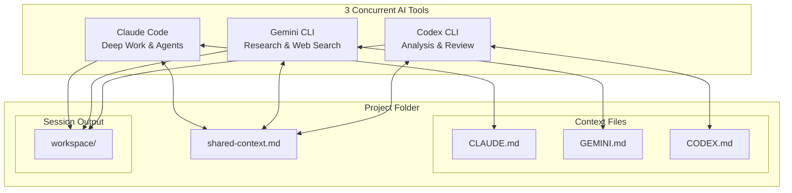
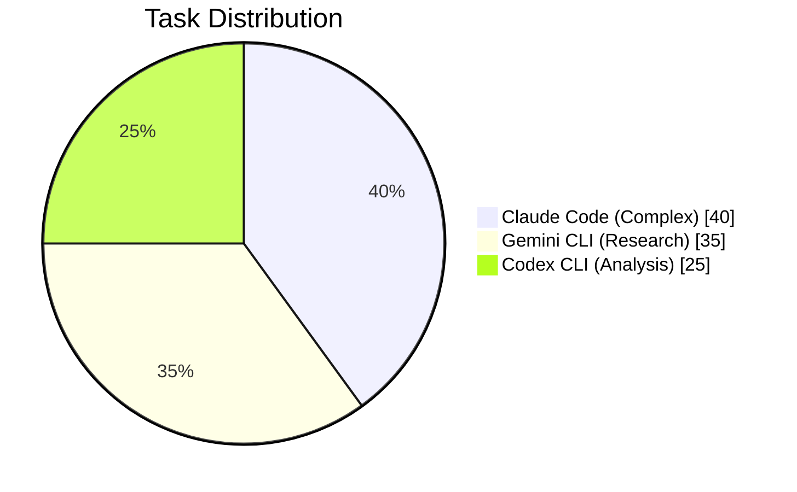

# 3-Model Concurrent Workflow About

## Overview

This document describes a 3-model concurrent workflow system for collaborative AI work. The system orchestrates three AI tools working simultaneously on a shared project:

- **Claude Code**: Handles complex tasks, deep work, and agent-based operations
- **Gemini CLI**: Specializes in research, web searching, and exploration
- **Codex CLI**: Focuses on analysis, code review, and reasoning

### Coordination Layer
- All three tools access a shared `shared-context.md` file that synchronizes state and notes between them
- Each tool has its own context file (`CLAUDE.md`, `GEMINI.md`, `CODEX.md`) for independent state
- When switching focus between tools, the `shared-context.md` gets updated as a handoff mechanism

### Output Organization
- `workspace/`: Session outputs organized by timestamp
  - Each session creates a folder: `workspace/YYYY-MM-DD_HH-MM-SS/`
  - Contains outputs from each tool: `claude_output.txt`, `gemini_output.txt`, `openai_output.txt`
  - Session manifest: `_session.json`

### Workflow Pattern
1. User runs `run.bat` and enters a task
2. All three tools launch concurrently and read the `shared-context.md`
3. Each tool works on its assigned specialty in parallel
4. When switching tools, the `shared-context.md` is updated as a handoff note
5. Changes are committed with git

### Task Distribution
The expected workload split is:
- Claude: 40% (complex implementation)
- Gemini: 35% (research and exploration)
- Codex: 25% (analysis and review)

This split is a reference point, not a quota.

This design allows you to parallelize work across different AI capabilities efficiently.

# 3-Model Concurrent Workflow Diagram

## System Architecture



## Workflow Pattern


## Tool Responsibilities



## Data Flow

```
Project folder
|-- Context files: CLAUDE.md, GEMINI.md, OPENAI.md
|-- shared-context.md (sync + handoff)
|-- workspace/ (session outputs)

Tools
|-- Claude Code -> workspace/
|-- Gemini CLI  -> workspace/
`-- OpenAI CLI  -> workspace/
```

