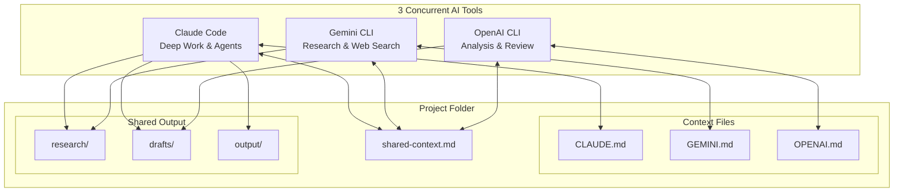
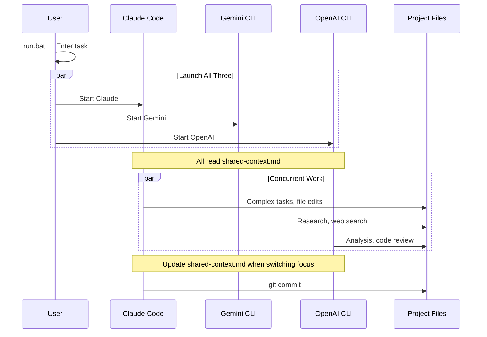

# 3-Model Concurrent Workflow Diagram

## System Architecture



## Workflow Pattern



## Tool Responsibilities


## Data Flow

```
┌─────────────────────────────────────────────────────────────────┐
│                        PROJECT FOLDER                            │
├─────────────────────────────────────────────────────────────────┤
│                                                                  │
│  ┌──────────┐    ┌──────────┐    ┌──────────┐                  │
│  │ CLAUDE.md│    │GEMINI.md │    │OPENAI.md │   Context Files  │
│  └────┬─────┘    └────┬─────┘    └────┬─────┘                  │
│       │               │               │                         │
│       ▼               ▼               ▼                         │
│  ┌─────────────────────────────────────────┐                   │
│  │          shared-context.md              │   Sync Layer      │
│  │   (Cross-tool state & handoff notes)    │                   │
│  └─────────────────────────────────────────┘                   │
│                       │                                         │
│       ┌───────────────┼───────────────┐                        │
│       ▼               ▼               ▼                         │
│  ┌─────────┐    ┌──────────┐    ┌──────────┐                   │
│  │research/│    │ drafts/  │    │ output/  │   Shared Output   │
│  └─────────┘    └──────────┘    └──────────┘                   │
│                                                                  │
└─────────────────────────────────────────────────────────────────┘
                              │
        ┌─────────────────────┼─────────────────────┐
        ▼                     ▼                     ▼
  ┌───────────┐        ┌───────────┐        ┌───────────┐
  │  Claude   │        │  Gemini   │        │  OpenAI   │
  │   Code    │        │   CLI     │        │   CLI     │
  ├───────────┤        ├───────────┤        ├───────────┤
  │ • Agents  │        │ • Web     │        │ • Code    │
  │ • Files   │        │   Search  │        │   Review  │
  │ • Complex │        │ • Research│        │ • Analysis│
  │   Tasks   │        │ • Explore │        │ • Reason  │
  └───────────┘        └───────────┘        └───────────┘
```
